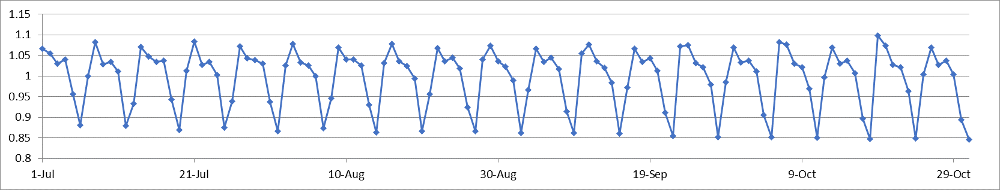

```{r}
# As best practice, setting the random number generator seed so that the results are reproducible
set.seed(1)
```
## Atlanta and the unofficial end of Summer Exploration
Using the 20 years of daily high temperature data for Atlanta (July through October) from file temps.txt, I'll build and use an exponential smoothing model to help make a judgement of whether the unofficial end of summer has gotten later over the 20 years. 

To start, I am setting my working directory and importing my data as a table. Once imported, I plan to read the head of the table to confirm I have imported the correct data set.
```{r Set directory and import data}
#set directory
#setwd(choose.dir())

#load data and read the headers
weather_data <- read.table("temps.txt", header=TRUE)
head(weather_data)
```

Now that I've confirmed the correct data, it is time to make a few conversions so that I can work with the data. First, I plan to convert the table into a vector with the unlist function. Given a list structure x, unlist simplifies it to produce a vector which contains all the atomic components which occur in x.

Once I have the vector of data, I can convert the data into time series with the ts function. 
```{r Convert data to vector then timeseries}
#unlist table into a vector 
vector <- as.vector(unlist(weather_data[,2:21]))
#convert vector to time series data
time_data <- ts(vector,start=1996, frequency=123)
```
With the data converted to a time series,I can decompose a time series into seasonal, trend and irregular components using moving averages with the decompose function. Decompose deals with an additive or multiplicative seasonal component, for this case I will use multiplicative seasonality.
```{r}
decompose <- decompose(time_data, type="multiplicative")
plot(decompose, xlab="Year")
```
From a quick glance of the decomposition, I can not define a clear trend (increasing or decreasing) in whether the unofficial end of summer has gotten later over the 20 years.


In attempt to find more information, I will use the HoltWinters function within R to analyze some of the data. The function Computes Holt-Winters Filtering of a given time series. Unknown parameters are determined by minimizing the squared prediction error.

Let's start with single exponential smoothing and see what we can find. In order to set the HoltWinters function to this, I set both Beta and Gamma to False within the function and use the time_data variable I saved the timeseries data to as the x. After running the function, I can print the results by saving them to a variable and running it on a line. I can plot the results as well with the plot function.   
```{r exponential smoothing}

test1 <- HoltWinters(time_data, beta=FALSE, gamma=FALSE)
test1

plot(test1, main="Exponential Smoothing - No trend/seasonality", xlab="Year", ylab="Temperature")
```
From the results above the plot, I can see the alpha value is ~0.838. From the videos that explain exponential smoothing, I can say that because the value is closer to 1, the model would pay more attenion towards the most recent observations. The baseline or a value towards the end is ~63.310 

The next exponential smoothing will be double, in order to set the HoltWinters function to this, I set Gamma to False within the function and use the time_data variable I saved the timeseries data to as the x. After running the function, I can print the results by saving them to a variable and running it on a line. I can plot the results as well with the plot function.   
```{r double exponential smoothing}
test2 <- HoltWinters(time_data, gamma=FALSE)
test2
plot(test2, main="Double Exponential Smoothing with Trend - No seasonality", xlab="Year", ylab="Temperature")
```
From the results above the plot, I can see the beta value ~0.004 and the final trend estimate value is ~(-0.073). With both these values so close to 0, it shows little to no value for a trend. 

The next exponential smoothing will be triple with additive seasonality, in order to set the HoltWinters function to this, I use the time_data variable I saved the timeseries data to as the x. After running the function, I can print the results by saving them to a variable and running it on a line. I can plot the results as well with the plot function.   
```{r triple exponential smoothing}
test3 <- HoltWinters(time_data)
test3
plot(test3,main="Triple Exponential Smoothing with Trend and Additive Seasonality", xlab="Year", ylab="Temperature")
```
From the results above the plot, I can see the beta value 0 and the final trend estimate value is ~(-0.004). With both these values so close to 0, it shows little to no value for a trend. 

The next exponential smoothing will be triple with multiplicative seasonality, in order to set the HoltWinters function to this, I use the time_data variable I saved the timeseries data to as the x and set multiplicative as the seasonal value. After running the function, I can print the results by saving them to a variable and running it on a line. I can plot the results as well with the plot function.  
```{r triple exponential smoothing with multiplicative seasonality}
test4 <- HoltWinters(time_data, seasonal="multiplicative")
test4
plot(test4, main="Triple Exponential Smoothing with Trend and Multiplicative Seasonality", xlab="Year", ylab="Temperature")

```
From the results above the plot, I can see the beta value 0 and the final trend estimate value is ~(-0.004). With both these values so close to 0, it shows little to no value for a trend.

To dive deeper into the data, I think I will look into the seasonal coefficients more. For a better view, I will use the fitted function on the last exponential smoothing with multiplicative seasonality. 
```{r}
test4$fitted
```

With the interest concentrating on seasonality, I will only call upon the seasonality column and place the items into a matrix. With the matrix, I will export to a CSV file so that I can perform additional cusum analysis inside of Microsoft Excel, rather than try to struggle my way through learning an additional function of R. 

```{r put seasonal factors into matrix}
matrix1 <- matrix(test4$fitted[,4], ncol=123)
matrix1
write.csv(matrix1, file = "seasonal.csv")
```

After performing the cusum analysis on the seasonality coefficients, I created a plot to look for any additional trends. 



With the analysis performed above, I feel confident in making a statement that over the past 20 years there have been no sufficient evidence to show whether or not the unofficial end of summer has gotten later. From the exponential smoothing, I identified little to no significance in any trend. In addition to the exponential smoothing of the timeseries data, the cusum analysis performed on the seasonal coefficients of the last exponential smoothing set showed little to zero variance as well. In conclusion, the unofficial end of summer has not gotten later over the 20 years analyzed.  


