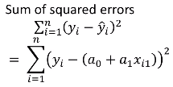

```{r}
# As best practice, setting the random number generator seed so that the results are reproducible
set.seed(1)
```

#Regression Prediction Model for Crime in a City

## Context of data explored
Using crime data from http://www.statsci.org/data/general/uscrime.txt (file uscrime.txt,
description at http://www.statsci.org/data/general/uscrime.html ), we will use regression to predict the observed crime rate in a city with the following data:

M = 14.0
So = 0
Ed = 10.0
Po1 = 12.0
Po2 = 15.5
LF = 0.640
M.F = 94.0
Pop = 150
NW = 1.1
U1 = 0.120
U2 = 3.6
Wealth = 3200
Ineq = 20.1
Prob = 0.04
Time = 39.0

Below, we will show our model (factors used and their coefficients), the software output, and the quality of fit.

To start, let's set the working directory and import the data as a table. Once imported, we can read the head of the table to confirm we have imported the correct data set.
```{r Set directory and import data}
#set directory
#setwd(choose.dir())

#load data and read the headers
crime_data <- read.table("uscrime.txt", header=TRUE)
head(crime_data)
```
Taking a look at the source of the data (http://www.statsci.org/data/general/uscrime.html), we have definitions for the variables listed in the table above: 

**Variable	 	Description**

* M - Percentage of males aged 14–24 in total state population
* So - Indicator variable for a southern state
* Ed	- Mean years of schooling of the population aged 25 years or over
* Po1 - Per capita expenditure on police protection in 1960
* Po2 - Per capita expenditure on police protection in 1959
* LF - Labour force participation rate of civilian urban males in the age-group 14-24
* M.F - Number of males per 100 females
* Pop - State population in 1960 in hundred thousands
* NW - Percentage of nonwhites in the population
* U1 - Unemployment rate of urban males 14–24
* U2 - Unemployment rate of urban males 35–39
* Wealth - Wealth: median value of transferable assets or family income
* Ineq - Income inequality: percentage of families earning below half the median income
* Prob - Probability of imprisonment: ratio of number of commitments to number of offenses
* Time - Average time in months served by offenders in state prisons before their first release
* Crime - Crime rate: number of offenses per 100,000 population in 1960


Now that we've confirmed the correct data, we will begin to explore the data. We will use regression to predict the observed crime rate in a city with the coefficients given above. In addition to using regression, we will show our model summary, the software output, and the quality of fit. In this exploration of the data set, crime will be a response, while the other variables will be predictors. 


```{r lm model}
#lm is used to fit linear models. It can be used to carry out regression, single stratum analysis of variance and analysis of covariance
#Using the entire dataset to build the regression model
model <- lm( Crime ~., data = crime_data)
#A summary of the model will allow us to see if there are any significant/insignificant 
#factors that could impact our model
summary(model)
```
```{r model p values}
#From the model summary, the p-values were in scientific formation. To make it easier to read,
#we will call on the p-value column to help identify significant/insignificant factors
summary(model)$coefficients[,4]
```

With the summary of the p-values above, we can see there are several factors with a p <= 0.1. To prevent any possible issues with our prediction, we will use the factors with smaller p values (M, Ed, Po1, U2, Ineq, Prob) to reduce any chance of skewing our prediction model. 

```{r clean lm model}
#Using the significant factors from the dataset to build the cleaned regression model
clean_model <- lm( Crime ~ M + Ed + Po1 + U2 + Ineq + Prob, data = crime_data)
#A summary of the clean model
summary(clean_model)
#plots of the clean_model
plot(clean_model)
```

Now that the cleaned LM summary of the data has been run, we want to predict the crime rate based on the given test variables provided at the beginning. To do this, we must first place the variables into a dataframe. 

```{r test df}
test <- data.frame(M = 14.0, So = 0, Ed = 10.0, Po1 = 12.0, Po2 = 15.5, LF = 0.640, M.F = 94.0, Pop = 150, NW = 1.1, U1 = 0.120, U2 = 3.6, Wealth = 3200, Ineq = 20.1, Prob = 0.040, Time = 39.0)
```

We can now run our prediction of crime rate against the test data points. 
```{r prediction}
prediction <- predict(clean_model, test)
prediction
```

```{r range of crime}
range(crime_data["Crime"])
```

Glancing quickly at the range of our Crime values, we can see that our prediction may be a good fit. But before making the assumption, let's dig deeper and find the quality of the fit. Initially, thoughts of using the Multiple R-Squared value from the summary tables above looked like it would work, but then I realized that it was only for the training data and not the full prediction model. 

This looks like an opportunity to use cross-validation on our given data and prediction models. A quick Google search for R Packages that provide cross-validation for linear regression lead me to the DAAG package, which includes several functions for cross-validating linear regression models. 

```{r install DAAG and open library}
#install.packages("DAAG")
library(DAAG)

```
Taking a look at the Cross-Validation for Linear Regression description in R-Studio, this function gives internal and cross-validation measures of predictive accuracy for multiple linear regression. The data are randomly assigned to a number of ‘folds’. Each fold is removed, in turn, while the remaining data is used to re-fit the regression model and to predict at the deleted observations. Since our data sample is relatively small, we will only use 5 folds to run the validation through. 

```{r cross-validation}
#assign a variable for the 5 fold cross-validation function
cross_validate <- cv.lm(crime_data,clean_model,m=5)
cross_validate
```
To calculate the the R-Squared values, we must use the formula (1 - SSEresiduals/SSEtotal).The formula for Sum of Squared errors, which I've listed below:



So we will first create a variable for the SSEtotal value, then a second variable for the SSEres_model value for our model, then a third variable SSEres_cross_validate for our cross validation function.
```{r SSE Variables and functions}
#SSEtotal 
SSEtotal <- sum((crime_data$Crime - mean(crime_data$Crime))^2)
#SSEres_model
SSEres_model <- sum(clean_model$residuals^2)
#SSEres_cross_validate
SSEres_cross_validate <- attr(cross_validate, "ms")*nrow(crime_data)
```
After creating our variables, we can now run our formulas and find the values that we are looking for. 

```{r R-squareds}
#model R-squared value
1-SSEres_model/SSEtotal
#cross_validated R-squared value
1-SSEres_cross_validate/SSEtotal
```

The calculations above show us that the R-squared value for the prediction model is 0.766 and that the R-squared value for the cross-validated function of the linear regression is 0.634. This shows that our prediction model is probably slightly overfitted. This makes sense though considering that we were only given 47 observations of data with 15 factors to predict with. Our ratio of data points to factors is marginally low with about 3:1 for our entire data set, when it is better to have about a 10:1 ratio for observations to factors. 
